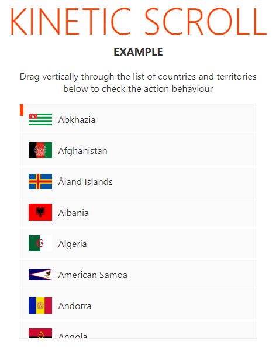

# Svelte Kinetic Scroll


Simple Svelte action to transform a container into a momentum scroller, much like cellphones touch screens work. Drop the action and start dragging around with your mouse.

There are a couple of settings that can optionally be passed into the action as an object with any of the following properties:

- **indicator** - ID of an element that should be within the container and be absolute positioned. This element will serve as an indicator of the scroll and is to be styled by you. Default: empty (no indicator will appear)

- **useWheel** - True if you wish to have some basic scroll wheel support. Default: true.



```html
<script>
    import countries from './countries.js';
    import { kineticscroll } from './kineticscroll.js';

    let configs = {
        indicator: 'littlebar'
    }
</script>

<section>
    <div class="container">
        <div id="littlebar"></div>
        <ul use:kineticscroll={configs}>
            {#each countries as country}
                <li>
                    
                    <span>{country.name}</span>
                </li>
            {/each}
        </ul>        
    </div>
</section> 

<style>
    #littlebar {
        position: absolute;
        left: 1px;
        width: 6px;
        height: 20px;
        background-color: #ff3e00;
        z-index: 1;
    }
</style>
```
This action expects that a container has a fixed height and a direct child that is longer than this height. If you intend to use an indicator, the container should be absolute or relative positioned. If it isn't the action will change its position to relative.

## Instalation and Usage

**Only tested on Svelte 3**

This is so simple that it doesn't need a NPM package. Just copy the file ``/src/kineticscroll.js`` to your project's appropriate folder and import it where needed. All other files are just there for the sake of the example.


## Example

Download this code, extract it and run:

```
npm i
npm run dev
```